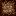

# 아이템 추가

## [공식 위키 보기](https://docs.fabricmc.net/develop/blocks/first-block)

## 코드
[ModBlocks.java](../src/main/java/com/reasure/test/block/ModBlocks.java)
```java
public class ModBlocks {
    public static final Block CONDENSED_DIRT = registerSimpleBlock("condensed_dirt", AbstractBlock.Settings.create().sounds(BlockSoundGroup.GRASS));

    public static Block registerSimpleBlock(String name, Block.Settings settings) {
        Identifier id = Identifier.of(Test.MOD_ID, name);
        RegistryKey<Block> key = RegistryKey.of(RegistryKeys.BLOCK, id);
        
        // Making Block
        Block block = new Block(settings.registerKey(key));
        
        // Making and Register BlockItem
        RegistryKey<Item> itemKey = RegistryKey.of(RegistryKeys.ITEM, id);
        BlockItem blockItem = new BlockItem(block, new Item.Settings().registryKey(itemKey).useBlockPrefixedTranslationKey());
        Registry.register(Registries.ITEM, itemKey, blockItem);
        
        // Register Block
        return Registry.register(Registries.BLOCK, key, block);
    }

    public static void initialize() {}
}
```
(메인 모드 파일)
[Test.java](../src/main/java/com/reasure/test/Test.java)
```java
public class Test implements ModInitializer {
    public static final String MOD_ID = "test";

    @Override
    public void onInitialize() {
        ModBlocks.initialize();
    }
}
```

## 텍스쳐파일
<br>
[assets/test/textures/block/condensed_dirt.png](../src/main/resources/assets/test/textures/block/condensed_dirt.png)

## 블록 모델 파일
[assets/test/models/block/condensed_dirt.json](../src/main/resources/assets/test/models/block/condensed_dirt.json)
```json
{
  "parent": "block/cube_all",
  "textures": {
    "all": "test:block/condensed_dirt"
  }
}
```
- 설명<br>
  `"test:block/condensed_dirt"` 부분은 [텍스쳐 파일](../src/main/resources/assets/test/textures/block/condensed_dirt.png) 경로를 의미함.

## BlockState 정의 파일
[assets/test/blockstates/condensed_dirt.json](../src/main/resources/assets/test/blockstates/condensed_dirt.json)
```json
{
  "variants": {
    "": { "model": "test:block/condensed_dirt" }
  }
}
```
- 설명<br>
  설치되었을때, 어떤 조건에 어떤 모델을 사용할지 정의하는 파일<br>
  위 코드는 가장 단순한 형태로, 항상 condensed_dirt 모델을 사용함을 의미<br>
  설치된 블록에만 해당하는 파일로, 아이템은 아이템 모델 정의 파일을 따로 작성해야 함<br>
  `"test:block/condensed_dirt"` 부분은 [모델 파일](../src/main/resources/assets/test/models/block/condensed_dirt.json) 경로를 의미함.

## 아이템 모델 정의 파일
[assets/test/items/condensed_dirt.json](../src/main/resources/assets/test/items/condensed_dirt.json)
```json
{
  "model": {
    "type": "minecraft:model",
    "model": "test:block/condensed_dirt"
  }
}
```
- 설명<br>
  인벤토리에서, 어떤 조건에 어떤 모델을 사용할지 정의하는 파일<br>
  위 코드는 가장 단순한 형태로, 항상 condensed_dirt 모델을 사용함을 의미<br>
  인벤토리 창의 아이템에만 해당하는 파일로, 설치된 블록은 Blockstate 정의 파일을 따로 작성해야 함.<br>
  원한다면, 아이템 모델파일을 따로 만들어서 적용해도 됨. - [아이템 추가](./AddItem.md) 부분 참고 <br>
  (즉, 인벤토리에서의 모습과 설치됐을 때 모습을 따로 만들 수도 있음)<br>
  `"test:block/condensed_dirt"` 부분은 [모델 파일](../src/main/resources/assets/test/models/block/condensed_dirt.json) 경로를 의미함.


## lang 파일
[assets/test/lang/en_us.json](../src/main/resources/assets/test/lang/en_us.json)
```json
{
  "block.test.condensed_dirt": "Condensed Dirt"
}
```
